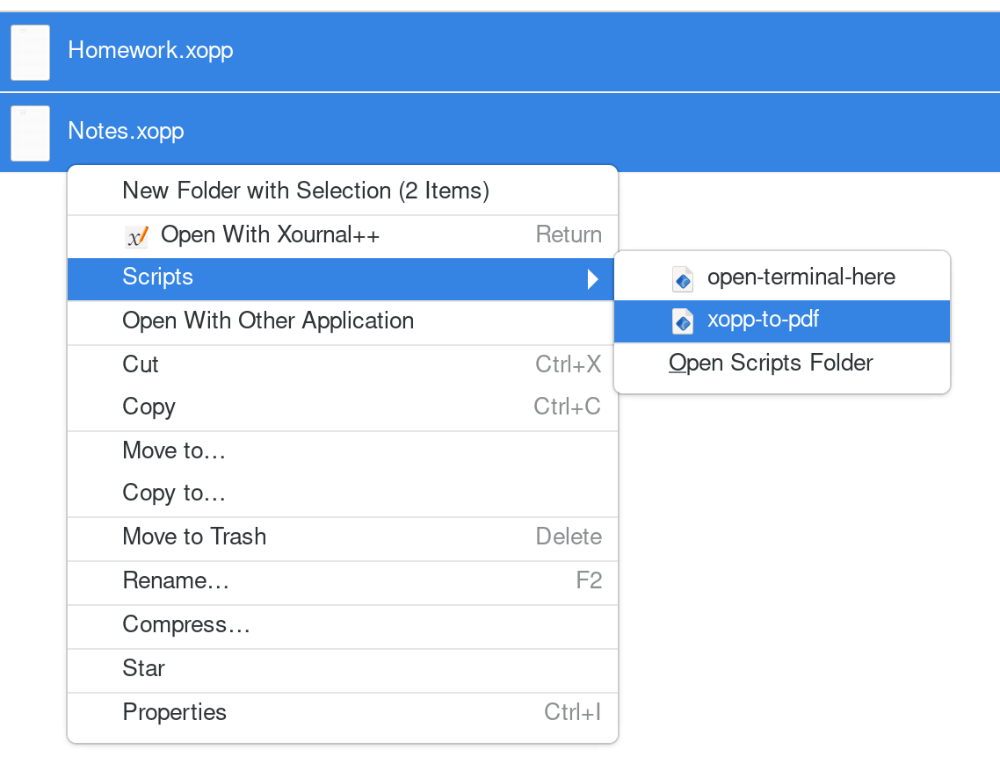

# Tips

## Convert Xournal++ files to PDF from context menu

There is a script that adds an option to the context menu to convert selected files from `.xopp` to `.pdf`.
It is available for the file managers `GNOME Files`/`Nautilus` and `Nemo`.

To use it, save [the script](../../resources/xopp-to-pdf) under

- `~/.local/share/nautilus/scripts/xopp-to-pdf` (for `GNOME Files`/`Nautilus`)
- `~/.local/share/nemo/scripts/xopp-to-pdf` (for `Nemo`)

and make it executable:

- `chmod +x <script-path>`
