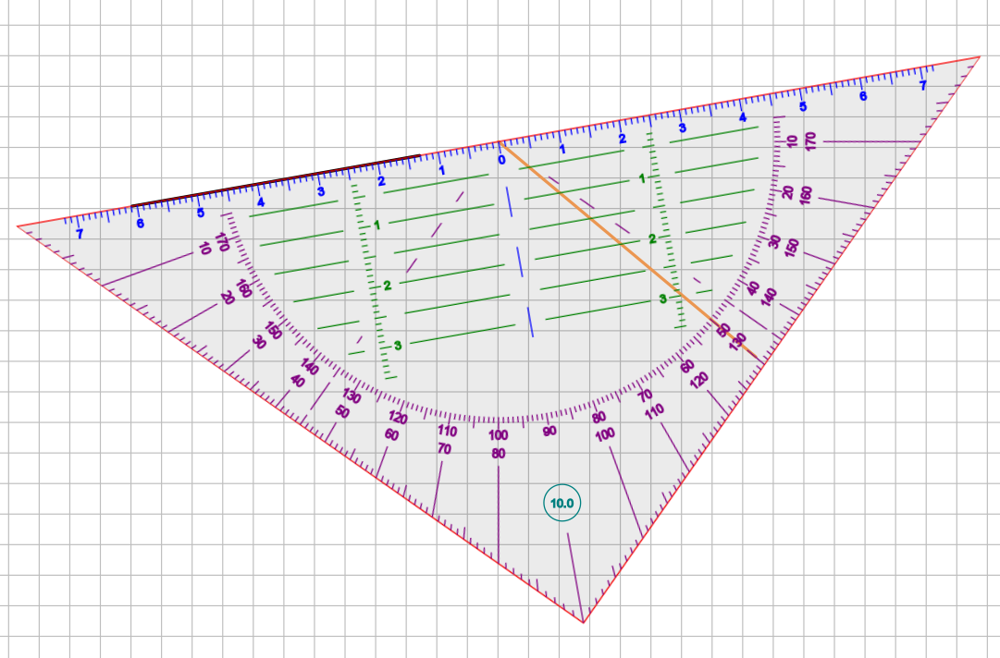
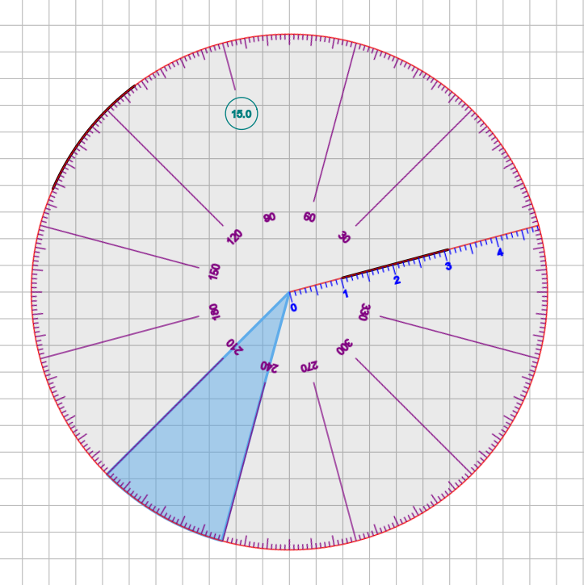

# Geometry tools

Xournal++ contains two geometry tools, a setsquare tool and a compass. They can be used for
measuring lengths of elements in the document and as a guide for drawing straight lines,
circles or parts thereof. You can even do geometric constructions with them. Both geometry
tools can be manipulated via touch on a touchscreen or via the keyboard. Drawing happens
through the mouse, stylus, or touchscreen.

## Setsquare overview

The setsquare is a ruler-like tool that is used to measure distances and angles and draw straight lines.
The setsquare is shaped like an isosceles triangle.

The longest side of the setsquare is used for measuring elements of the document and drawing
straight lines aligned to it.
There are marks (in green) parallel to the longest side of the setsquare, that allow
measuring distances from that side.

Angular marks (in purple) help measuring angles.
The current rotation of the setsquare (in tenth of degrees) will be shown in a circular display, near the angle made by the two shorter sides of the setsquare.
In the picture above, this angle is 10.0 degrees.

The shorter two sides of the setsquare can be used to drawing lines from the middle point of the longest side of the setsquare.
This can be activated by clicking/touching near the two shorter sides of the setsquare.

## Compass overview

The compass is a wheel-shaped tool used to measure angles and draw circles/arcs/sectors.

The compass can be used for drawing circles, arcs, and (when "fill" is enabled)
circular sectors.
To activate this feature, draw near the edge of the compass (but inside it).

Lines can also be drawn along the axis marked with measuring marks. The radius of the
compass/drawn circles can be seen from the last displayed measuring mark.

Angular marks (in purple) help measuring angles. Like for the setsquare, there is a display of the
current rotation of the compass.

## Units, distinguished point and axis

For all geometry tools, lengths are measured in centimeters and angles are measured in degrees.

Each geometry tool has a distinguished point and a distinguished axis through that point.
The distinguished point is used as a rotation and scaling center when rotating/scaling via keyboard.
Angles are measured between horizontal axis and distinguished axis.

- **Setsquare**: The distinguished axis and point are the longest side of the setsquare and its
  midpoint, respectively.
- **Compass**: Its distinguished point is the center of the compass wheel. The distinguished axis
  is a radius that carries measuring marks and can be used to draw a radius or part of it.

## Setup and activation

In order to setup the geometry tools, check your Display DPI Calibration in the Zoom panel of menu
`Edit > Preferences` to ensure that the length on your screen matches the physical length. Set
the zoom to 100% to profit from the calibration.

Switch one geometry tool on/off either from menu `Tools` or via the toolbar (setsquare/compass symbol).
Only one geometry tool can be used at once. When a geometry tool is switched on while another one
is active, the latter one is switched off.
A geometry tool is always attached to one particular page of the document. If you need it on a
different page of the document, deactivate it on the old one and activate it on the new one.
This can be achieved by clicking twice on the corresponding symbol on the toolbar.

The geometry tools are designed to be used either with touch (one hand) and stylus/mouse
(other hand) or with keyboard (one hand) and stylus/mouse (other hand).

- **Keyboard and Touch** are used to move the geometry tool (and the page) around, to rotate
  it and change its size. All geometry tools react in the same way to keyboard and touch input.
- **Stylus/Mouse** are used to draw/annotate. Different geometry tools react differently to
  stylus/mouse input.

## Keyboard control

Several keys can be used to move, rotate and scale the geometry tool. The `Alt` modifier can
be used to get smaller steps.

- `arrow keys` for moving around. Steps are 0.25 cm (big) and 0.25 mm (small). Use the shift
  key to make the geometry tool move parallel or perpendicular to the longest side of the
  setsquare.
- `r/R` for rotation (countclockwise/clockwise) around the distinguished point. Steps are 5
  degrees (big) and 0.2 degrees (small)
- `s/S` for scaling (up/down) centered at the distinguished point. Steps for scaling up are
  10% (big) and 1% (small). Scaling down has the opposite effect.
- `m` for marking the distinguished point by adding a small "x" to the page.

## Touch control

Touch can be used with one finger or two fingers. Gestures with more fingers are not handled.

### One finger touch

- Touch the geometry tool and move your finger around to move the geometry tool.
  If you move the distinguished point close to some line segment, the geometry tool will get
  rotation snapped to it, if its distinguished axis is at most 3 degrees from the line segment
  (or of a perpendicular line). This is useful for drawing a perpendicular line or a line in a
  specific angle from an existing line and for measuring angles between line segments.
- Touch the page outside the geometry tool and move your finger around to move the whole
  page including the geometry tool. When "Touch drawing" is enabled in the preferences, the
  page will not be moved. Instead usual touch drawing happens outside the geometry tool.

### Two fingers touch

The rotation and scaling centers are the midpoint between the two fingers. The action depend
on where you put your first finger and partly also where you put the second finger.

- A touch sequence with two fingers, where the first finger touching the screen is outside
  the geometry tool, acts in the usual way (for zooming and scrolling the whole page)
- A touch sequence with two fingers, where both fingers are placed inside the geometry tool
  is used for simultaneous scrolling/rotating/resizing. Currently the zoom gesture preferences
  from the Touchscreen panel in menu `Edit > Preferences` are also applied for the resizing
  operation. Setting the percentage to something like 50% helps avoiding unintended resizing.
- A touch sequence with two fingers, where the first finger touching the screen inside the
  geometry tool and the second finger outside the geometry tool leads to scrolling/resizing
  without rotation (and also no rotation snapping).

## Interaction with other tools

When a geometry tool is activated, there are special **Stylus/Mouse** interactions with the
Pen, Highlighter and Hand tool.

### Interaction with the Pen/Highlighter

#### Setsquare

- Start a stroke inside the setsquare, not further than 0.5 cm from its longest side, to draw
  a line aligned to the longest side of the setsquare. It doesn't matter what drawing type you
  use.
- Start a stroke inside the setsquare, not further than 0.5 cm from one of the shorter
  sides, but outside the above mentioned region, to get a line from the chosen point to the
  midpoint of the longest side of the setsquare. Note that you can move the end point of that
  radial line around to get the desired length and angle. When the end point passes the
  semicircle with the measuring marks, the angle gets locked, so you have the chance to draw
  small radii without losing the precision for the angle in which it is drawn.
- Start a stroke outside the two regions described above to get normal drawing. This can be
  used for annotation.

#### Compass

- Start a stroke inside the compass, not further than 0.5 cm from its border, to draw a
  circle arc aligned to the border. It doesn't matter what drawing type you use.
- Start a stroke near the distinguished axis with the measuring marks to draw a radial segment.
- Start a stroke outside the two regions described above to get normal drawing, used for
  annotation.

### Interaction with the Hand tool

- Use it in the inside of the geometry tool to move the geometry tool only.
- Use it on the outside of the geometry tool to move the whole page along with the geometry
  tool.
