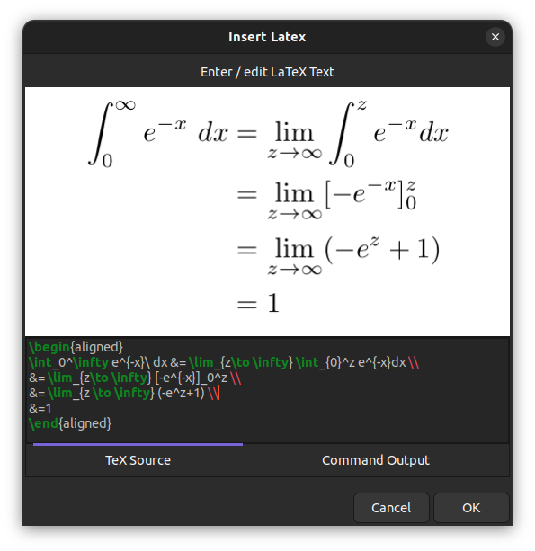
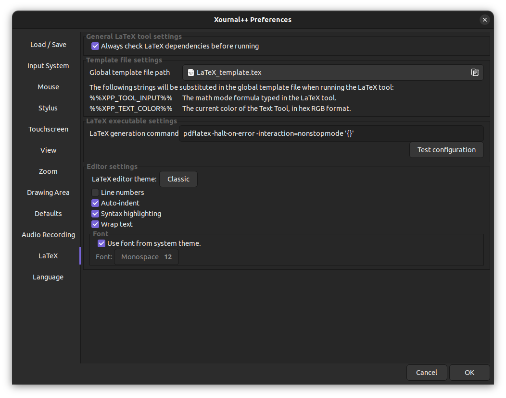
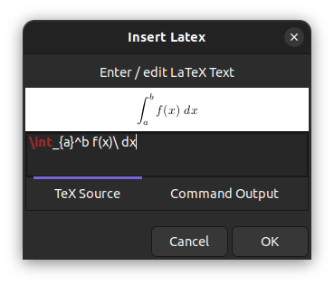
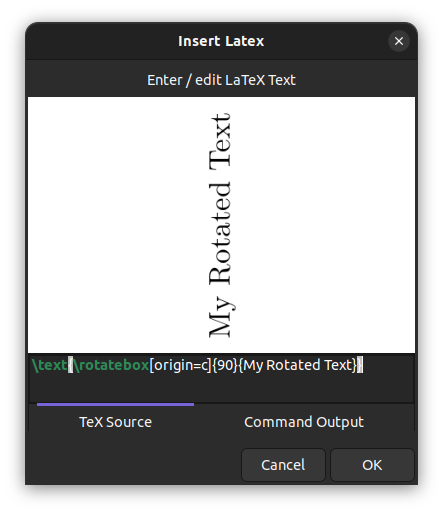
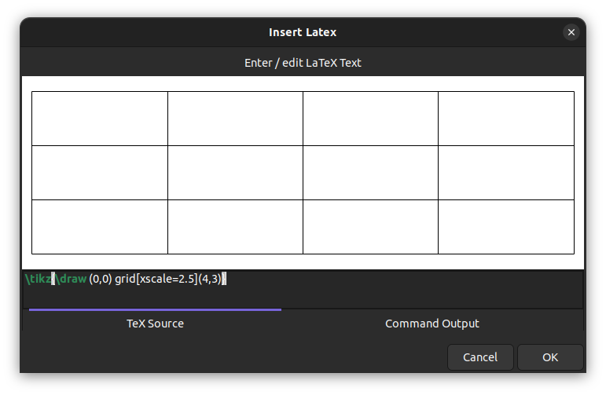
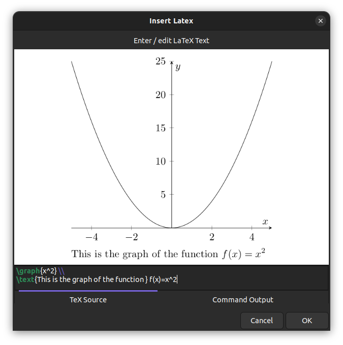
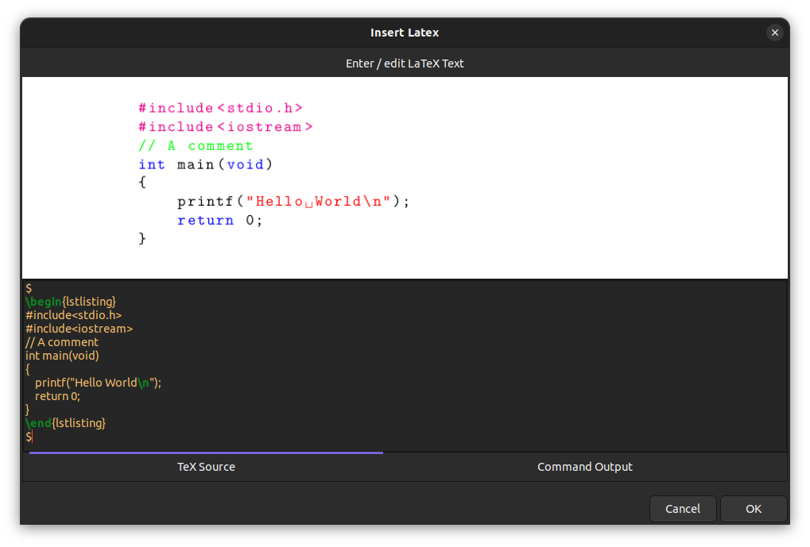
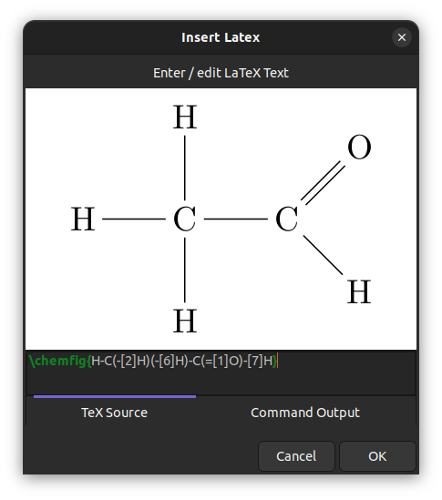
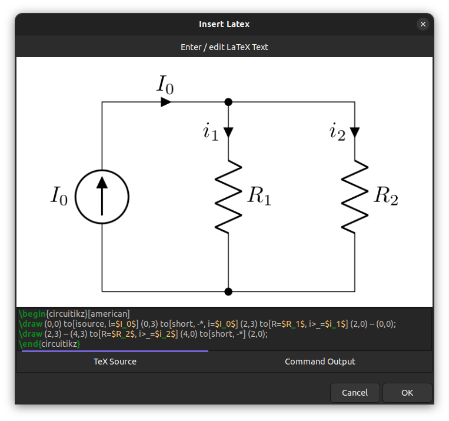
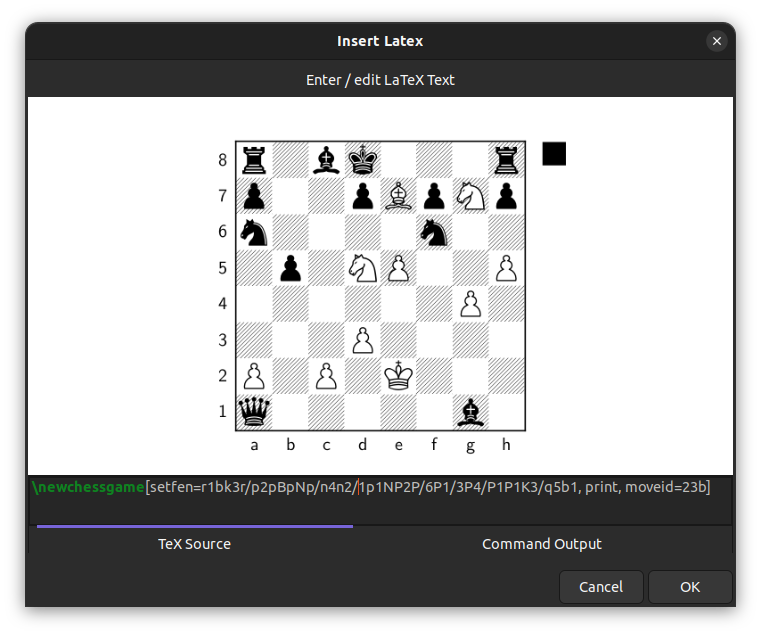

# LaTeX tool

Using the LaTeX tool you can insert LaTeX formulas into a Xournal++ document.
In order to use this tool you must have LaTeX installed on your system.



!!! note
    The screenshots on this page show the latest nightly version.
    In the latest nightly version, the preview dialog has a resizable
    window, word wrap, auto-indentation, and syntax highlighting.
    It also has a separate `Command Output` tab that displays the output from
    the LaTeX generator command (e.g. `pdflatex`).

## Setup

The LaTeX tool requires a TeX distribution to be installed on your computer. See
[this link](https://www.latex-project.org/get/) for a guide on how to install
one. Some distributions that have worked for users include
[MikTeX](https://miktex.org/) on Windows, [MacTeX](https://www.tug.org/mactex/)
on macOS, and [TeX Live](https://www.tug.org/texlive/) on Linux.

If you would prefer a more minimal TeX distribution that requires little space on
your hard drive, use [TinyTeX](https://github.com/rstudio/tinytex-releases),
which is available on Windows, macOS and Linux. Start with a minimal base and use
`tlmgr` to install further packages. TinyTeX is also bundled with the
[Snap package](https://snapcraft.io/xournalpp) on Linux. Check out
[this file](https://github.com/kenvandine/xournalpp/blob/stable/pkgs-custom.txt)
for a list of TeX packages installed with it.

Once you have installed a TeX distribution, you can check if it works correctly
from the Preferences window. This can be done by accessing `Edit > Preferences`
from the menu and clicking on the `Test configuration` button in the LaTeX tab.



### Frequently encountered setup problems

* **pdflatex or kpsewhich cannot be found**: make sure that a TeX distribution
  is installed on your computer, and check that you are able to run LaTeX
  outside of Xournal++. If you have just installed MikTeX on Windows, you may
  need to run MikTeX at least once to install the necessary programs.
  
* **The package `standalone` cannot be found**: Xournal++ uses the TeX package
  `standalone` in order to render formulas. Please make sure the TeX
  distribution that you are using has the `standalone` package installed (if you
  are using TeX Live, you may need to install the extra packages to get
  `standalone`).
  
* **The LaTeX tool doesn't work with the Flatpak installation**: The Flatpak version
  requires the Flathub TeX Live extension, which can be installed with the command:
  
  ```term
  flatpak install flathub org.freedesktop.Sdk.Extension.texlive//21.08
  ```

* **The LaTeX tool doesn't work with the AppImage**: The .AppImage is a compressed
  file that contains the default template and legacy template, but these files
  cannot be accessed. Please copy the default template or legacy template either
  by extracting the .AppImage or by downloading it from the
  [github page](https://raw.githubusercontent.com/xournalpp/xournalpp/master/resources/legacy_template.tex).

* **I still get an error even when `pdflatex` and `standalone` are installed**:
  The default template makes use of the `scontents` package, which may not be
  included with your TeX distribution. Try [changing the template
  file](#template) to the `legacy_template.tex` that is in the same location as
  `default_template.tex`, which should not use the `scontents` package. If you
  have any further issues, feel free to [ask for help](../../community/help.md).

## Basic LaTeX formulas

Clicking on the LaTeX button in the toolbar will bring up a dialog which will allow you to type in a formula. A preview will be displayed in the center of the dialog, which will keep updating as you type and indicate whether your formula is valid.



Once you are done, you can click the OK button to insert the LaTeX into the document; the rendered formula will appear at the center of the current page. The formula can be selected, moved scaled and edited as desired.

Note that the LaTeX formula will always be set in *inline math mode*. If you want to exit math mode, you should write a $-sign to leave math mode and add another $-sign at the end to reenter math-mode. For instance the LaTeX formula

```tex
$\huge$ x^2
```

will use the command `\huge` to increase the font size, which cannot be done in math mode.

## Customization of the template {: #template }

The LaTeX formulas are rendered by substituting the user-provided formula (along
with other information like tool color) into a _template file_. The template
file to use can be changed in the LaTeX tab of the Preferences window.

A default LaTeX template is provided under the name `default_template.tex`. Clicking on it, you will find its location in your file system (within the [shared resources folder](../file-locations.md)).

To generate a custom LaTeX template, make a copy of the default template, save
it under a different name, and customize it. Some suggestions are listed here:

- Include the [**graphicx** package](https://ctan.org/pkg/graphicx) by adding `\usepackage{graphicx}` to your template file. As an example this will give you the possibility to add rotated text via a LaTeX formula like

```tex
\text{\rotatebox[origin=c]{90}{My Rotated Text}}
```



- Include the [**TikZ** package](https://www.ctan.org/pkg/pgf) via `\usepackage{tikz}` for creating drawings with the powerful TikZ tool. A simple example would be to draw a table (or grid) with n rows and m columns via `\tikz{\draw (0,0) grid(m,n)}`. See [this issue](https://github.com/xournalpp/xournalpp/issues/2179) for more information.



- With TikZ included, also include the [**PGFPlots** package](https://www.ctan.org/pkg/pgfplots) via `\usepackage{pgfplots}`
for plotting function graphs. Using a macro, you will be able to plot function graphs nicely and very quickly.
For example, add the following lines to your template:

```teX
%for defining commands
\usepackage{xargs}

% for drawing and plotting
\usepackage{pgfplots}
\pgfplotsset{compat=newest} % Allows to place the legend below plot
\newcommandx{\graph}[3][1=,2=]{
    \begin{tikzpicture}
    \begin{axis}[xlabel=$x$,ylabel=$y$, axis lines=center,samples=100, #2]
    \addplot[#1]{ #3 };
    \end{axis}
    \end{tikzpicture}
}
```

Then a LaTeX-formula like `\graph{x^2}` will plot the normal parabola and `\graph[domain=-2:2, blue][x=1cm,y=1cm]{x^2}` will further restrict the domain, set the color and define units.



- Include the [**Listings** package](https://www.ctan.org/pkg/listings) via `\usepackage{listings}` for proper alignment and syntax coloring of code snippets. You need to define the style with `lstset` as in the following example, which you can add to your template:

```tex
\usepackage{listings}
\lstset{language=C++,
                basicstyle=\ttfamily,
                keywordstyle=\color{blue}\ttfamily,
                stringstyle=\color{red}\ttfamily,
                commentstyle=\color{green}\ttfamily,
                morecomment=[l][\color{magenta}]{\#}
}
```

In the LaTeX formula you can then use the `lstlistings` enivronment as in the following example

```tex
$
\begin{lstlisting}
#include<stdio.h>
#include<iostream>
// A comment
int main(void)
{
    printf("Hello World\n");
    return 0;
}
\end{lstlisting}
$
```



Note that the starting and trailing $-signs are needed to exit and reenter math mode.

- Include the [**chemfig** package](https://ctan.org/pkg/chemfig) via `\usepackage{chemfig}` for drawing chemical molecules. For example to draw an ethanal molecule, use the LaTeX formula

```tex
\chemfig{H-C(-[2]H)(-[6]H)-C(=[1]O)-[7]H}
```



- Include the [**circuitikz** package](https://ctan.org/pkg/circuitikz) via `\usepackage{circuitikz}` for drawing electric circuits.

This can be used as in the following example:

```tex
\begin{circuitikz}[american]
\draw (0,0) to[isource, l=$I_0$] (0,3) to[short, -*, i=$I_0$] (2,3) to[R=$R_1$, i>_=$i_1$] (2,0) -- (0,0);
\draw (2,3) -- (4,3) to[R=$R_2$, i>_=$i_2$] (4,0) to[short, -*] (2,0);
\end{circuitikz}
```



- Include the [**xskak** package](https://ctan.org/pkg/xskak) via `usepackage{xskak}` for drawing chess positions.

For example to get the mating position of the [immortal game](https://en.wikipedia.org/wiki/Immortal_Game), use the LaTeX formula

```tex
\newchessgame[setfen=r1bk3r/p2pBpNp/n4n2/1p1NP2P/6P1/3P4/P1P1K3/q5b1, print, moveid=23b]
```

